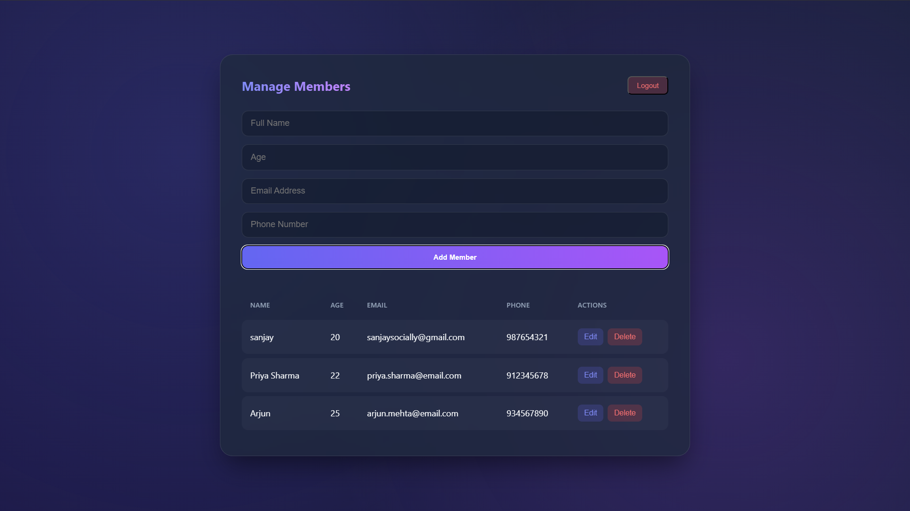

# 🔐 User Credentials Management System

A modern, secure, and scalable **User Management Application** designed to handle authentication, authorization, and profile management using enterprise-grade practices.

---

## 🚀 Features

- **User CRUD Operations**  
  Create, Read, Update, and Delete user records.

- **Authentication Ready**  
  Extendable for OAuth2, JWT, or SSO integrations.

- **Role & Permission Management**  
  Fine-grained access control for Admins, Members, and Guests.

- **Responsive UI**  
  Clean, minimal, and seamless user experience.

- **Scalable Architecture**  
  Modular design ready for microservices or serverless deployment.

- **Security First**  
  Input validation, hashed passwords, and secure session handling.

---

  

## 🛠️ Tech Stack

**Frontend:** React / Next.js  
**Backend:** Node.js + Express  
**Database:** PostgreSQL / MongoDB  
**Authentication:** JWT / OAuth2 / SSO  
**Deployment:** Docker + Kubernetes  

---
---

## 🔒 Security Best Practices

- 🔑 **Store passwords using bcrypt or Argon2**
- 🌐 **Use HTTPS in production**
- 🚦 **Implement rate limiting and CSRF protection**
- 🔍 **Regularly audit dependencies for vulnerabilities**
- 🔐 **Use environment variables for sensitive configurations**

---

## 🧩 Extensibility

- 🔐 **Add Multi-Factor Authentication (MFA)**
- 🏢 **Integrate with LDAP / Active Directory**
- 🌍 **Support social logins (Google, GitHub, Facebook)**
- 📜 **Implement audit logs for compliance tracking**
- 📈 **Add monitoring & logging (Prometheus / ELK)**

---

## 🤝 Contributing

We welcome contributions!

1. Fork the repository  
2. Create a feature branch  
3. Commit your changes with clear messages  
4. Push to your branch  
5. Submit a Pull Request  

---
